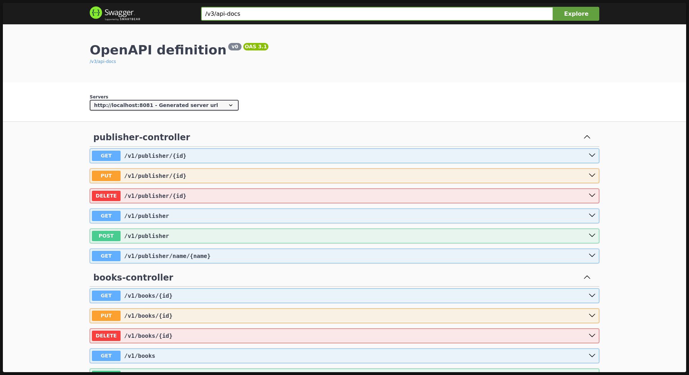
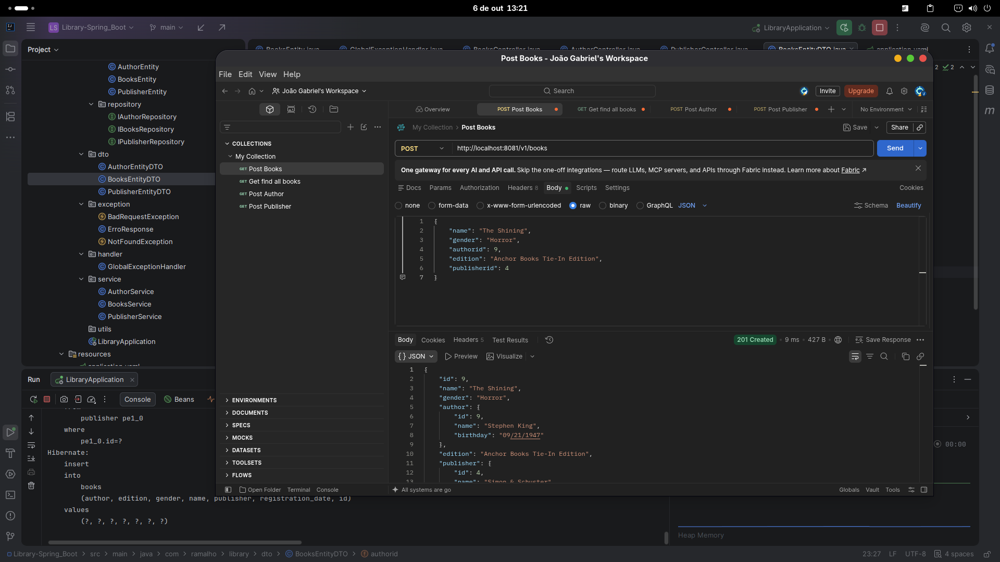

# Library API

A RESTful library management API built with Java and Spring Boot. The system manages books, authors, and publishers with relational data integrity, centralized exception handling, and auto-generated API documentation.

<p align="center">
  
</p>

## Features

- Full CRUD operations for Books, Authors, and Publishers
- Relational data modeling with JPA (`@ManyToOne` relationships between Book, Author, and Publisher)
- Request/response separation using DTOs, keeping entities isolated from the API contract
- Centralized exception handling via `@RestControllerAdvice`
- Input validation with Bean Validation (`@Valid`, `@NotNull`, `@NotBlank`, etc.)
- Pagination and sorting support on listing endpoints
- Custom query methods (search by name, order by registration date, etc.)
- Auto-generated, interactive API documentation with Swagger/OpenAPI
- Manually tested with Postman across all endpoints

## Technologies Used

- Java 25
- Spring Boot
- Spring Data JPA / Hibernate
- PostgreSQL
- Bean Validation (Jakarta Validation)
- Lombok
- Springdoc OpenAPI (Swagger UI)
- Maven
- Postman (manual testing)

## Project Structure

```
library/
├── controller/       REST endpoints, request/response handling
├── service/          Business logic and orchestration
├── database/
│   ├── model/         JPA entities
│   └── repository/    Spring Data JPA repositories
├── dto/              Request and response DTOs
├── exception/        Custom exceptions and error response models
├── handler/          Global exception handler
└── LibraryApplication.java
```

## Architecture

The project follows a layered architecture, separating responsibilities across distinct packages:

- **Controller** — receives HTTP requests, delegates to the service layer, and returns the appropriate HTTP response. Contains no business logic.
- **Service** — holds all business rules, orchestrates calls to repositories, and enforces validation beyond what annotations alone can express.
- **Repository** — interfaces extending `JpaRepository`, responsible for data access. Most queries are handled through Spring Data JPA query methods, without manual SQL.
- **Entity** — represents the database tables and their relationships.
- **DTO** — defines what enters and leaves the API, decoupled from the internal entity structure.

<p align="center">
  
</p>


## DTOs

Entities are never exposed directly through the API. Each operation uses a DTO tailored to its purpose:

- Request DTOs expose only the fields a client should be able to send. Relationships are represented by their identifiers (e.g. `authorId`, `publisherId`) rather than nested objects, avoiding ambiguity about which data is authoritative.
- Response payloads return the full entity graph (including related Author and Publisher data), since consumers of the API generally benefit from having that context without an additional request.

This separation keeps the internal data model free to evolve independently of the public API contract.

## Validation

Input validation is handled with Jakarta Bean Validation annotations directly on the DTOs (`@NotBlank`, `@NotNull`, among others), combined with `@Valid` on controller method parameters. Invalid requests are rejected before reaching the service layer, and the global exception handler returns a structured, descriptive error response.

## Exception Handling

A custom exception (`NotFoundException` and `BadRequestException`) is thrown whenever a requested resource does not exist. Exceptions are **not** caught locally inside each controller method; instead, a single `@RestControllerAdvice` class intercepts them application-wide and converts them into consistent, structured HTTP error responses — avoiding repeated try/catch blocks across endpoints.

## Pagination

Listing endpoints support pagination and sorting through Spring Data's `Pageable`, allowing clients to request a specific page, page size, and sort order via query parameters:

```
GET /v1/books?page=0&size=10&sort=registrationDate,desc
```

Responses include pagination metadata (total elements, total pages, current page) alongside the requested content.

## API Documentation

Full API documentation is generated automatically with Springdoc OpenAPI and available through Swagger UI once the application is running:

```
http://localhost:8081/swagger-ui.html
```

<!-- IMAGE: Swagger UI expanded view of the books-controller endpoints -->

## Getting Started

### Prerequisites

- Java Development Kit (JDK) 25 or higher
- Apache Maven
- PostgreSQL

### Installation

1. Clone the repository:
```bash
git clone https://github.com/rmlho/Library-Spring_Boot.git
cd Library-Spring_Boot
```

2. Create a PostgreSQL database for the project.

3. Configure the database connection in `src/main/resources/application.yaml` using environment variable:
```yaml
spring:
  datasource:
    url: jdbc:postgresql://localhost:5432/your_database
    username: ${DB_USERNAME}
    password: ${DB_PASSWORD}
  jpa:
    hibernate:
    ddl-auto: update
```

4. Build and run the application:
```bash
mvn clean install
mvn spring-boot:run
```

5. The API will be available at `http://localhost:8081`, and the interactive documentation at `http://localhost:8081/swagger-ui.html`.

## Usage Example


Creating a book:

```
POST /v1/books
Content-Type: application/json

{
    "name": "The Shining",
    "gender": "Horror",
    "authorId": 9,
    "edition": "Anchor Books Tie-In Edition",
    "publisherId": 4
}
```

## Roadmap

- [x] CRUD for Books, Authors, and Publishers
- [x] DTO-based request/response separation
- [x] Centralized exception handling
- [x] Input validation
- [x] Pagination and sorting
- [x] Swagger/OpenAPI documentation
- [ ] Authentication and authorization with Spring Security (JWT)
- [ ] Containerization with Docker
- [ ] Cloud deployment

## Author

Joao Gabriel Ramalho

- GitHub: [@rmlho](https://github.com/rmlho)
